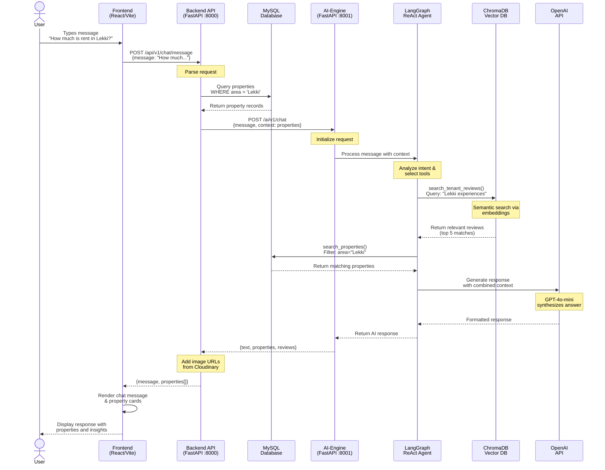
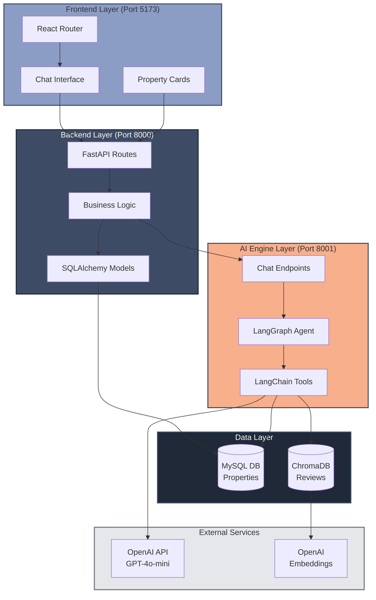
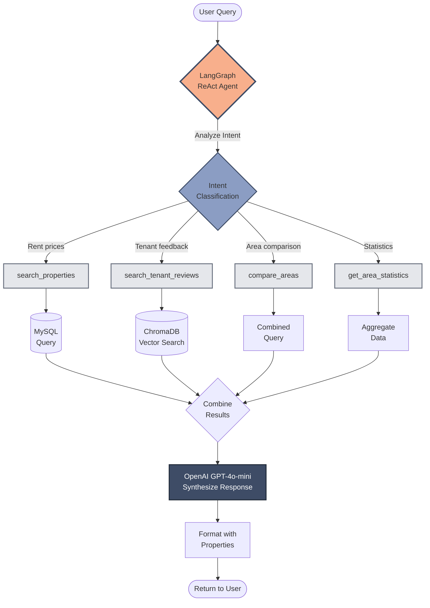

# Housing Intelligence Platform

A conversational AI-powered housing intelligence platform for Lagos, Nigeria. Users interact with an intelligent chatbot to discover rental properties, understand market prices, and learn from real tenant experiences.

## Overview

The platform combines real-time property data with AI-driven insights to help users make informed housing decisions. Using RAG (Retrieval-Augmented Generation), the system semantically searches through tenant reviews while providing up-to-date property listings and pricing information across Lagos neighborhoods.

## Key Features

- **Conversational AI Interface** - Natural language chat powered by OpenAI GPT-4o-mini
- **Semantic Search** - RAG-based search over 250+ tenant reviews using ChromaDB
- **Real-time Property Data** - Live property listings with prices, locations, and availability
- **LangGraph ReAct Agent** - Intelligent agent that automatically selects appropriate tools based on user queries
- **Area Insights** - Statistics and comparisons across Lagos neighborhoods (Lekki, Ikeja, Victoria Island, etc.)
- **Image Gallery** - Property photos with carousel view and modal display
- **Responsive Design** - Modern UI with Tailwind CSS and smooth animations

## Tech Stack

### Frontend
- **React 18** with **Vite** - Fast, modern development experience
- **Tailwind CSS** - Utility-first styling with custom design system
- **Framer Motion** - Smooth animations and transitions
- **Axios** - HTTP client for API communication
- **React Router** - Client-side routing

### Backend
- **FastAPI** - High-performance Python web framework
- **SQLAlchemy** - SQL ORM for MySQL database operations
- **MySQL** - Relational database for structured property data
- **Pydantic** - Request/response validation
- **python-dotenv** - Environment configuration

### AI Engine
- **LangGraph** - ReAct (Reasoning + Acting) agent framework
- **LangChain** - Tool orchestration and LLM integration
- **OpenAI API** - GPT-4o-mini for chat, text-embedding-3-small for vectors
- **ChromaDB** - Vector database for semantic search (embedded mode)
- **FastAPI** - Separate microservice for AI operations

## Architecture

The platform uses a **three-tier microservices architecture** for scalability and separation of concerns:

```
┌─────────────┐      ┌─────────────┐      ┌─────────────┐
│             │      │             │      │             │
│  Frontend   │─────▶│   Backend   │─────▶│ AI-Engine   │
│  (Vite)     │      │  (FastAPI)  │      │  (FastAPI)  │
│  Port 5173  │      │  Port 8000  │      │  Port 8001  │
│             │      │             │      │             │
└─────────────┘      └──────┬──────┘      └──────┬──────┘
                            │                    │
                            ▼                    ▼
                      ┌──────────┐         ┌──────────┐
                      │  MySQL   │         │ ChromaDB │
                      │ Database │         │  (RAG)   │
                      └──────────┘         └──────────┘
```

### Application Flow

The following diagram illustrates the complete request/response flow when a user asks a question:



### Service Responsibilities

- **Frontend**: User interface, chat interactions, property display
- **Backend**: API orchestration, database operations, business logic
- **AI-Engine**: LLM calls, embeddings, vector search, agent reasoning

### Data Flow Example

When a user asks *"How much is rent in Lekki?"*:

1. Frontend sends message to Backend `/api/v1/chat/message`
2. Backend queries MySQL for Lekki properties
3. Backend forwards request to AI-Engine `/ai/v1/chat` with property context
4. AI-Engine's ReAct agent:
   - Analyzes intent
   - Calls `search_tenant_reviews` tool for Lekki experiences
   - Calls `search_properties` tool for current listings
   - Synthesizes results with GPT-4o-mini
5. Backend adds image URLs and returns response
6. Frontend displays chat message with property cards

### Component Interaction Diagram



### LangGraph Agent Decision Flow



## Quick Start

### Prerequisites

- **Python 3.9+** (for Backend and AI-Engine)
- **Node.js 16+** and **npm** (for Frontend)
- **MySQL 8.0+** (for property database)
- **OpenAI API Key** (for LLM and embeddings)

### 1. Clone Repository

```bash
git clone https://github.com/yourusername/housing_intelligence_platform.git
cd housing_intelligence_platform
```

### 2. Setup Backend

```bash
cd backend

# Create virtual environment
python -m venv venv
venv\Scripts\activate  # Windows
# source venv/bin/activate  # Mac/Linux

# Install dependencies
pip install -r requirements.txt

# Configure environment
cp .env.example .env
# Edit .env with your MySQL credentials and AI-Engine URL

# Initialize database
python scripts/init_db.py
python scripts/seed_database.py  # Seed 80 properties
python scripts/seed_reviews.py   # Seed 250 reviews

# Run server
uvicorn app.main:app --reload --port 8000
```

**Backend should now be running at** `http://localhost:8000`

### 3. Setup AI-Engine

```bash
cd ai-engine

# Create virtual environment
python -m venv venv
venv\Scripts\activate  # Windows
# source venv/bin/activate  # Mac/Linux

# Install dependencies
pip install -r requirements.txt

# Configure environment
cp .env.example .env
# Edit .env with your OpenAI API key

# Seed ChromaDB with review embeddings
python scripts/seed_chromadb.py

# Run server
uvicorn app.main:app --reload --port 8001
```

**AI-Engine should now be running at** `http://localhost:8001`

### 4. Setup Frontend

```bash
cd frontend

# Install dependencies
npm install

# Configure environment
cp .env.example .env
# Edit .env with backend API URL (default: http://localhost:8000/api/v1)

# Run development server
npm run dev
```

**Frontend should now be running at** `http://localhost:5173`

### 5. Test the Application

1. Open `http://localhost:5173` in your browser
2. Click "Start Chatting" on the landing page
3. Try queries like:
   - "How much is rent in Lekki?"
   - "Show me 2-bedroom apartments in Ikeja"
   - "What do tenants say about Victoria Island?"
   - "Compare rent prices in Yaba and Surulere"

## Environment Variables

### Backend `.env`

```bash
# MySQL Configuration
MYSQL_HOST=localhost
MYSQL_USER=root
MYSQL_PASSWORD=your_password
MYSQL_DATABASE=housing_db

# Service URLs
AI_ENGINE_URL=http://localhost:8001

# Cloudinary (for production image storage)
CLOUDINARY_CLOUD_NAME=your_cloud_name
CLOUDINARY_API_KEY=your_api_key
CLOUDINARY_API_SECRET=your_api_secret
```

### AI-Engine `.env`

```bash
# OpenAI Configuration
OPENAI_API_KEY=your_openai_api_key
OPENAI_MODEL=gpt-4o-mini

# ChromaDB Configuration
CHROMADB_COLLECTION=tenant_reviews
```

### Frontend `.env`

```bash
# Backend API URL
VITE_API_URL=http://localhost:8000/api/v1
```

## API Documentation

Once services are running, access interactive API documentation:

- **Backend Swagger UI**: `http://localhost:8000/docs`
- **Backend ReDoc**: `http://localhost:8000/redoc`
- **AI-Engine Swagger UI**: `http://localhost:8001/docs`
- **AI-Engine ReDoc**: `http://localhost:8001/redoc`

### Key Endpoints

#### Backend

- `POST /api/v1/chat/message` - Send chat message, get AI response
- `GET /api/v1/properties` - List properties (filter by area, bedrooms, price)
- `GET /api/v1/properties/{id}` - Get property details
- `GET /api/v1/health` - Health check

#### AI-Engine

- `POST /ai/v1/chat` - Chat with ReAct agent
- `POST /ai/v1/chat/stream` - Streaming chat response
- `GET /ai/v1/health` - Health check

## Project Structure

```
housing_intelligence_platform/
├── backend/                  # Main API server
│   ├── app/
│   │   ├── main.py          # FastAPI application
│   │   ├── config.py        # Settings and configuration
│   │   ├── database.py      # SQLAlchemy setup
│   │   ├── models/          # Database models (User, Property, Review)
│   │   ├── schemas/         # Pydantic request/response schemas
│   │   ├── api/             # API route handlers
│   │   └── services/        # Business logic
│   ├── scripts/             # Database seeding scripts
│   └── requirements.txt
│
├── ai-engine/               # AI/RAG microservice
│   ├── app/
│   │   ├── main.py          # FastAPI application
│   │   ├── core/
│   │   │   ├── agent.py     # LangGraph ReAct agent
│   │   │   ├── tools.py     # LangChain tools
│   │   │   ├── prompts.py   # System prompts
│   │   │   └── vector_db.py # ChromaDB connection
│   │   ├── services/        # Embedding and RAG services
│   │   └── api/             # AI endpoints
│   ├── scripts/             # ChromaDB seeding
│   ├── chroma/              # ChromaDB storage (auto-generated)
│   └── requirements.txt
│
├── frontend/                # React UI
│   ├── src/
│   │   ├── App.jsx          # Main app component
│   │   ├── pages/           # Landing and Chat pages
│   │   ├── components/      # Reusable components
│   │   │   ├── Chat/        # Chat interface components
│   │   │   ├── Properties/  # Property cards and modals
│   │   │   └── common/      # Shared UI components
│   │   ├── services/        # API client
│   │   └── hooks/           # Custom React hooks
│   ├── public/              # Static assets
│   ├── tailwind.config.js   # Tailwind configuration
│   └── package.json
│
├── CLAUDE.md                # Development guidelines
├── PLAN.md                  # Implementation roadmap
└── README.md                # This file
```

## Database Schema

### MySQL Tables

**properties**
- `id`, `title`, `description`, `area`, `address`, `property_type`
- `bedrooms`, `bathrooms`, `rent_price`, `is_available`
- `created_at`, `updated_at`

**property_images**
- `id`, `property_id` (FK), `image_url`, `cloudinary_public_id`

**reviews**
- `id`, `property_id` (FK), `user_id` (FK), `rating`, `comment`
- `chromadb_id` (reference to vector DB)
- `created_at`

**users**
- `id`, `email`, `full_name`, `phone`, `role`
- `created_at`

### ChromaDB Collection

**tenant_reviews**
- Document: Review text
- Metadata: `review_id`, `area`, `property_type`, `rent_paid`, `rating`
- Embeddings: OpenAI text-embedding-3-small (1536 dimensions)

## Development Commands

### Backend

```bash
# Run server
uvicorn app.main:app --reload --port 8000

# Run with auto-reload
uvicorn app.main:app --reload

# Initialize database
python scripts/init_db.py

# Seed data
python scripts/seed_database.py
python scripts/seed_reviews.py
```

### AI-Engine

```bash
# Run server
uvicorn app.main:app --reload --port 8001

# Seed ChromaDB
python scripts/seed_chromadb.py
```

### Frontend

```bash
# Development server
npm run dev

# Build for production
npm run build

# Preview production build
npm run preview

# Lint code
npm run lint
```

## Testing

### Manual Testing

```bash
# Test Backend health
curl http://localhost:8000/health

# Test AI-Engine health
curl http://localhost:8001/health

# Test chat endpoint
curl -X POST http://localhost:8000/api/v1/chat/message \
  -H "Content-Type: application/json" \
  -d '{"message": "How much is rent in Lekki?"}'

# Test properties endpoint
curl http://localhost:8000/api/v1/properties?area=Lekki&bedrooms=2
```

## Design System

### Color Palette

- **Primary**: `#8B9DC3` (Light blue-gray)
- **Marlin**: `#3E4C66` (Medium blue)
- **Port Gore**: `#1F2937` (Dark navy - primary background)
- **Rajah**: `#F8AF8C` (Peach/salmon - accent for CTAs)
- **Off White**: `#F8F8F8` (Light backgrounds)

### Typography

- **Font**: Raleway (Google Fonts)
- **Weights**: Regular 400, Semibold 600

## Deployment

### Environment-Specific Considerations

**Backend**:
- Use production MySQL database
- Configure Cloudinary for image storage
- Set `AI_ENGINE_URL` to production AI-Engine URL

**AI-Engine**:
- Ensure OpenAI API key has sufficient credits
- ChromaDB can scale to persistent mode for production

**Frontend**:
- Build with `npm run build`
- Set `VITE_API_URL` to production backend URL
- Deploy to Vercel, Netlify, or similar

### Recommended Stack

- **Frontend**: Vercel
- **Backend + AI-Engine**: Railway, Render, or DigitalOcean
- **Database**: PlanetScale (MySQL) or AWS RDS
- **Vector DB**: ChromaDB persistent mode or Pinecone

## Common Lagos Areas

The platform currently supports these Lagos neighborhoods:

- Lekki
- Ikeja
- Victoria Island (VI)
- Yaba
- Surulere
- Ikoyi
- Ajah
- Gbagada
- Maryland
- Magodo

## Contributing

1. Fork the repository
2. Create a feature branch (`git checkout -b feature/amazing-feature`)
3. Commit your changes (`git commit -m 'Add amazing feature'`)
4. Push to branch (`git push origin feature/amazing-feature`)
5. Open a Pull Request

## Troubleshooting

### Backend won't connect to MySQL

- Verify MySQL is running: `mysql -u root -p`
- Check credentials in `backend/.env`
- Ensure database exists: `CREATE DATABASE housing_db;`

### AI-Engine returns errors

- Verify OpenAI API key is set in `ai-engine/.env`
- Check API key has sufficient credits
- Ensure ChromaDB is seeded: `python scripts/seed_chromadb.py`

### Frontend can't reach Backend

- Check `VITE_API_URL` in `frontend/.env`
- Verify Backend is running on port 8000
- Check CORS configuration in `backend/app/main.py`

### ChromaDB collection not found

- Run seeding script: `cd ai-engine && python scripts/seed_chromadb.py`
- Verify collection name matches `CHROMADB_COLLECTION` in `.env`

## License

This project is licensed under the MIT License - see the LICENSE file for details.

## Acknowledgments

- OpenAI for GPT-4o-mini and text embeddings
- LangChain and LangGraph for agent framework
- ChromaDB for vector database
- FastAPI for excellent Python web framework
- React, Tailwind and Vite for modern frontend development

## Contact

abdullahbadru66@gmail.com
https://www.linkedin.com/in/abdullahibadrudeen
+234 903 4869 909
